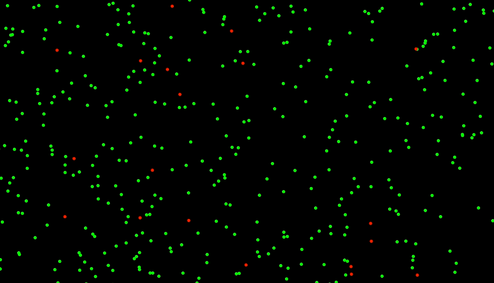

# Evolutionary Agents
Genetic algorithm experiments based on [evolutionary steering behaviour project](https://thecodingtrain.com/CodingChallenges/069.1-steering-evolution) by Dan Shoffman. 

## What if creatures are on a diet?

## What if a poison turn out to be nutrition?

